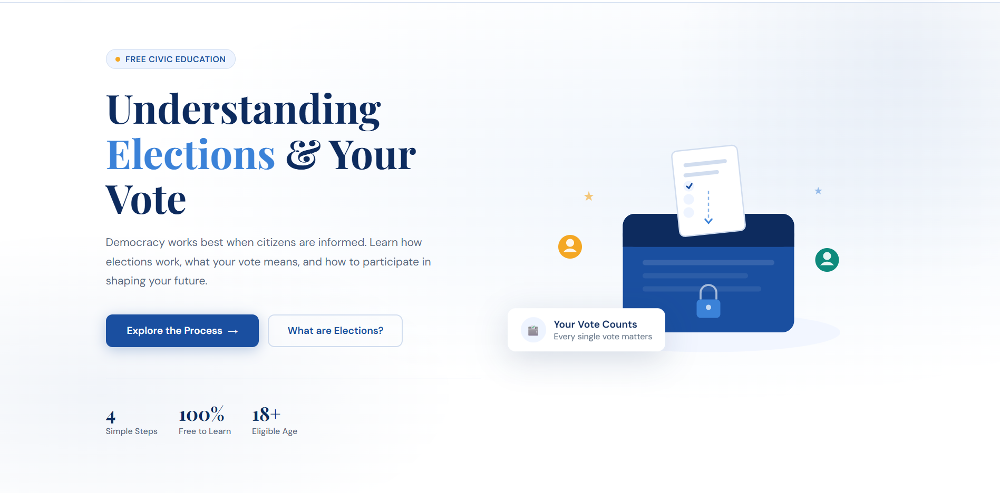
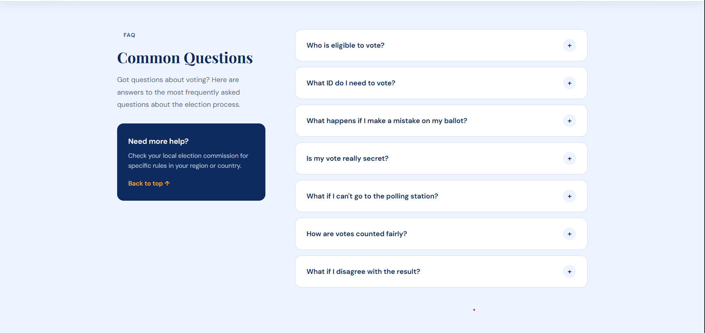
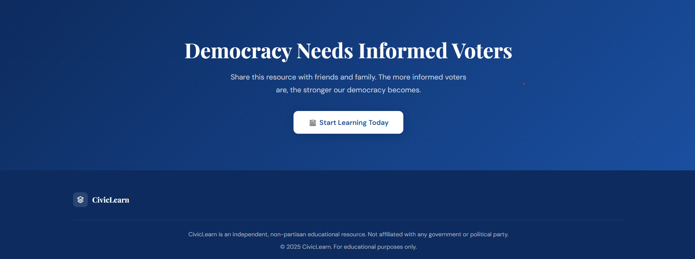

# 🗳️ CivicLearn – Voter Education Portal

A modern and interactive civic education website designed to help users understand elections, voting rights, and democratic processes in a simple and engaging way. CivicLearn breaks down complex election concepts into easy-to-follow explanations, visual timelines, and interactive content, making it ideal for first-time voters, students, and anyone interested in learning about democracy.

---

## 🌟 Features

### 🏠 Modern Landing Page

* Clean and professional design
* Custom election-themed SVG illustration
* Call-to-action buttons
* Key election statistics

### 📖 Understanding Elections

* Explains what elections are
* Importance of voting in a democracy
* Representation and accountability concepts
* Interactive information cards

### 🛤️ Election Process Timeline

Step-by-step explanation of the complete election journey:

1. Voter Registration
2. Campaigning Period
3. Election Day & Voting
4. Vote Counting & Results

Each step includes examples and visual indicators for better understanding.

### 📚 Key Democratic Concepts

Learn important principles such as:

* 🔒 Secret Ballot
* ⚖️ One Person, One Vote
* 👁️ Transparent Counting
* 📅 Regular Elections
* 🏛️ Independent Election Bodies
* 📣 Freedom to Campaign

### ❓ Interactive FAQ Section

Frequently asked questions with expandable accordion functionality.

### ✨ User Experience Features

* Smooth scrolling navigation
* Scroll reveal animations
* Active navigation highlighting
* Responsive mobile menu
* Fully responsive design

---

## 🛠️ Technologies Used

| Technology       | Purpose                     |
| ---------------- | --------------------------- |
| HTML5            | Website Structure           |
| CSS3             | Styling & Responsive Design |
| JavaScript (ES6) | Interactivity               |
| SVG              | Custom Illustrations        |
| Google Fonts     | Typography                  |

---

## 📂 Project Structure

```bash
📁 CivicLearn
│
├── index.html
├── styles.css
├── script.js
│
└── screenshots
    ├── hero-section.png
    ├── election-process-1.png
    ├── election-process-2.png
    ├── election-process-3.png
    ├── key-concepts-1.png
    ├── key-concepts-2.png
    ├── faq-section.png
    └── footer.png
```

---

## 🚀 Getting Started

### Clone the Repository

```bash
git clone https://github.com/your-username/civiclearn.git
```

### Open the Project

```bash
cd civiclearn
```

### Run the Website

Simply open:

```bash
index.html
```

in any modern web browser.

No additional installations or dependencies are required.

---

## 📸 Website Preview

### 🏠 Hero Section

A visually engaging landing page introducing elections and the importance of informed voting.



---

### 🛤️ Election Process – Voter Registration

Explains how citizens become eligible voters through registration.


---

### 📢 Election Process – Campaigning Period

Demonstrates how candidates present their ideas and policies to voters.

### 🗳️ Election Day & Voting

Shows how votes are securely cast and protected.


---

### 📊 Vote Counting & Results

Illustrates the process of counting ballots and declaring official results.


---

### 📚 Key Concepts

Highlights important democratic principles that ensure fair elections.


---

### 📖 Additional Election Principles

Explains election integrity, independent commissions, and voter rights.


---

### ❓ FAQ Section

Interactive accordion component answering common election-related questions.



---

### 🚀 Call-to-Action & Footer

Encourages civic participation and provides quick navigation links.



---

## 🎥 Demo Video

Watch the complete project walkthrough:

🔗 **Demo Video:**
https://drive.google.com/file/d/11Zz37YxcG8HHtKt65aP6hjGzlIvkw59J/view?usp=sharing

---

## 🎯 Project Objectives

The primary goal of CivicLearn is to:

* Promote civic awareness
* Educate first-time voters
* Simplify election-related concepts
* Encourage informed participation in democracy
* Provide accessible educational resources

---

## 📱 Responsive Design

The website is optimized for:

* 💻 Desktop
* 🖥️ Laptop
* 📱 Mobile
* 📲 Tablet

Responsive layouts ensure a consistent experience across all screen sizes.

---

## 📈 Future Enhancements

* 🌐 Multi-language support
* 📊 Interactive election statistics dashboard
* 🗺️ Election map visualizations
* 🎥 Educational video content
* ♿ Improved accessibility features
* 📱 Progressive Web App (PWA) support
* 🔍 Search functionality

---

## 👨‍💻 Author

**Daksh Gajjar**

Passionate about creating educational and user-friendly web experiences using modern front-end technologies.

---

## 📄 License

This project is open-source and available for educational and learning purposes.

---

### ⭐ If you found this project useful, consider giving it a star on GitHub!

**Democracy works best when citizens are informed.**
